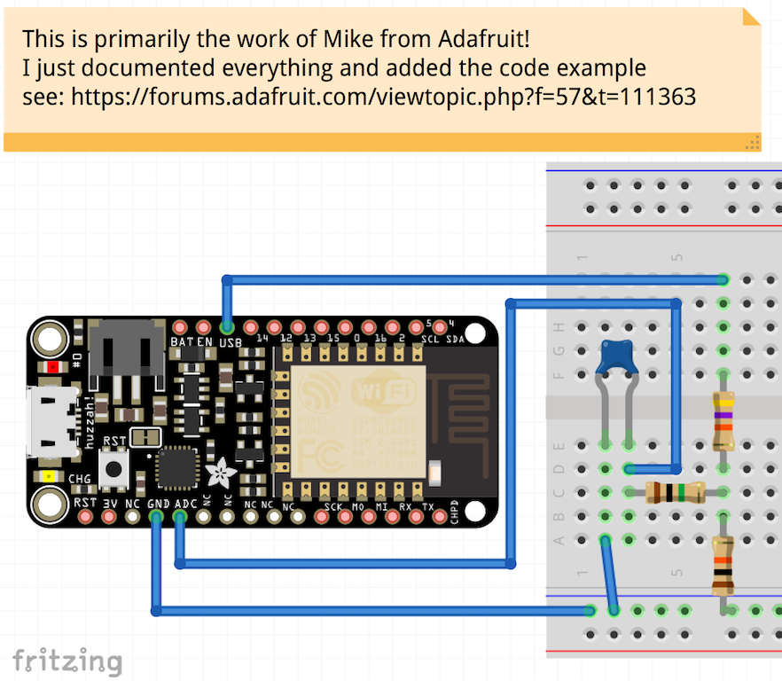
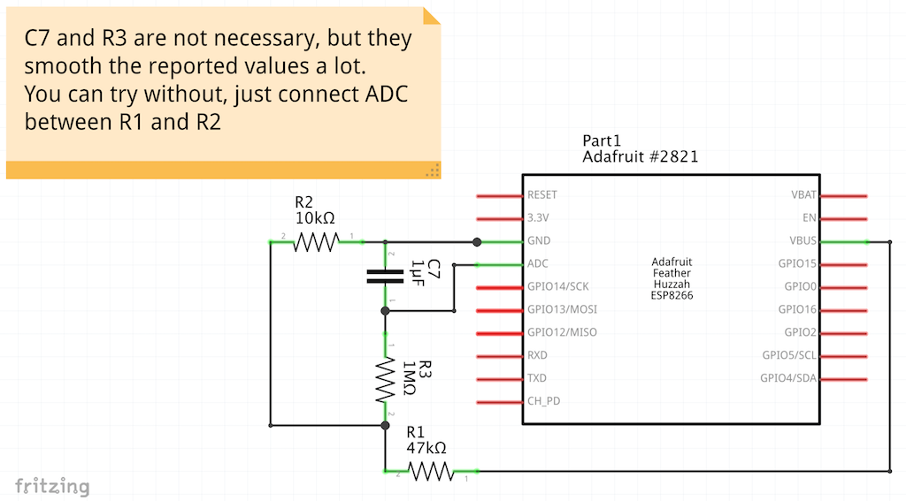
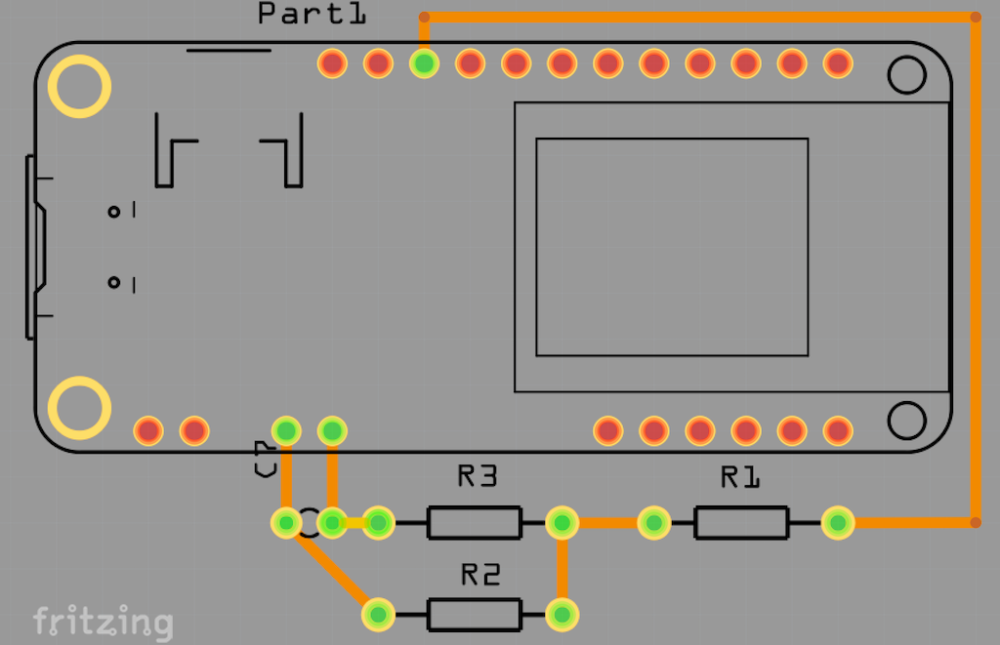
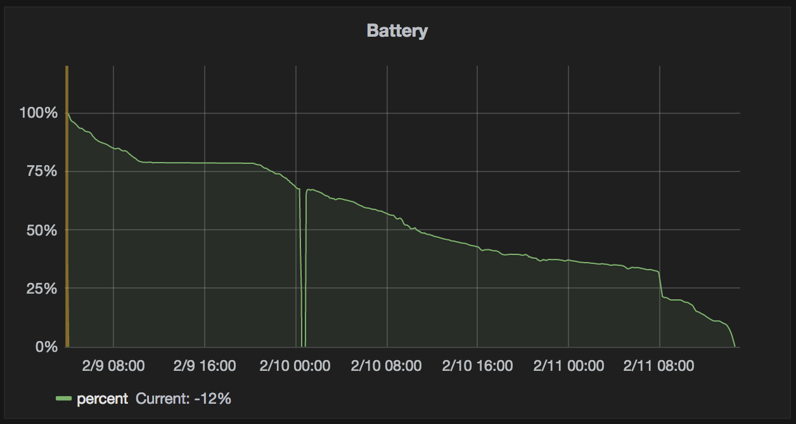
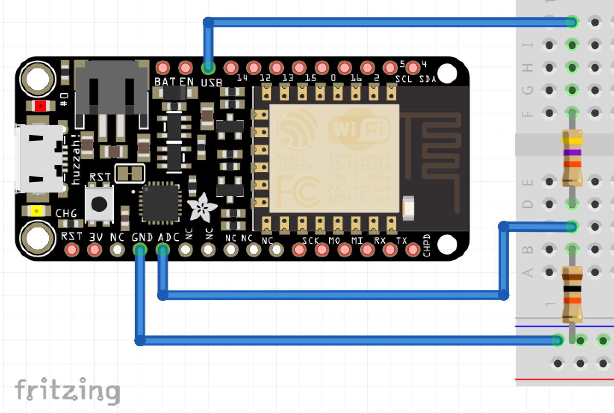

## Adafruit Feather Huzzah 8266 Battery Monitor

Simple setup to monitor LiPo battery level

## License

## Parts needed

- 1 x Adafruit Feather Huzzah 8266
- 1 x 10kΩ resistor
- 1 x 48kΩ resistor
- 1 x 1MΩ resistor (optional)
- 1 x 1µF capacitor (optional)

## Description

_First off, it's not my circuit, it's based on a [proposal by Mike from Adafruit](https://forums.adafruit.com/viewtopic.php?f=57&t=111363), i just documented all the stuff._ 
  
Adafruit Feathers support LiPo batteries, but you'd like to monitor the battery level to know, when to recharge.
 
The existing projects only covered the battery itself but failed to distinguish USB power from battery, so i asked around and this is the result.
 
This circuit consists of two parts:
 
1. A voltage divider consisting of 10kΩ and 47kΩ resistors. This will get the voltage from the **USB**[[1]](#note1) Pin down to safe levels for the ADC pin (max. 1V).
 
2. A 1MΩ resistor and a 1µF capacitor to smooth the reported values a bit. It's not necessary, but improves the results ([see below](#optional-without-capacitor))
 
Combined with the WiFi capabilities, you can draw nice graphs and add alerting.
 
<a name="note1">[1]</a>: between 3.0V and 5.0V, depending if USB is connected and the battery charge

## Schema

## PCB

## Graphed example

## Optional: without capacitor

As a comparison look at the above graph, it's without the capacitor before _2/9 12:00_ and with capacitor after _2/10 0:00_

